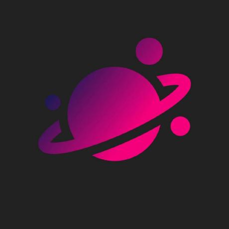

<a id="readme-top"></a>


<!-- PROJECT LOGO -->
<br />
<div align="center">
  <a href="https://github.com/carsonOK/Nebula">
    
  </a>

<h3 align="center">Nebula</h3>

  <p align="center">
	Nebula is a fully open-source note taking app with AI functionality, and can even be run without internet!* 
<br><br>
*AI functionality may vary.
  </p>
</div>


## Getting Started

To get a local copy of Nebula up and running follow these simple steps!

1. Clone the repo
   ```sh
   git clone https://github.com/carsonOK/nebula.git
   ```
2. Open index.html!
   
Congrats! You know have a locally hosted version of Nebula to try out!


<!-- ROADMAP -->
## Roadmap

- [x] Client-side code
- [ ] Public API key
- [ ] Username/password auth
- [ ] Paid Plans
    - [ ] There will still be a free plan! :)

See the [open issues](https://github.com/carsonOK/nebula/issues) for a full list of proposed features (and known issues).


<!-- CONTRIBUTING -->
## Contributing

Contributions are what make the open source community such an amazing place to learn, inspire, and create. Any contributions you make are **greatly appreciated**.

If you have a suggestion that would make this better, please fork the repo and create a pull request. You can also simply open an issue with the tag "enhancement".
Don't forget to give the project a star! Thanks again!

1. Fork the Project
2. Create your Feature Branch (`git checkout -b feature/AmazingFeature`)
3. Commit your Changes (`git commit -m 'Add some AmazingFeature'`)
4. Push to the Branch (`git push origin feature/AmazingFeature`)
5. Open a Pull Request


### Top contributors:

<a href="https://github.com/carsonOK/nebula/graphs/contributors">
  
</a>
